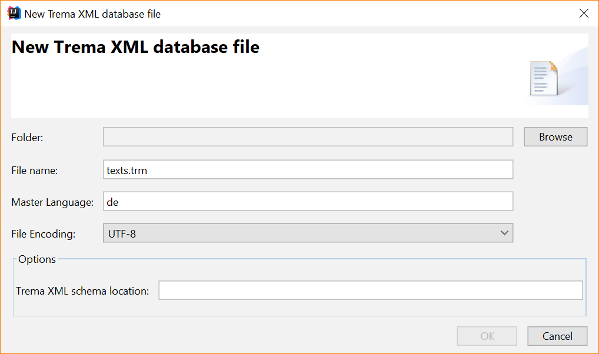
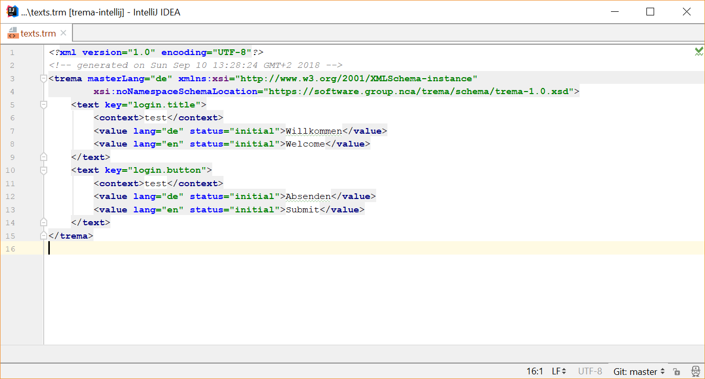
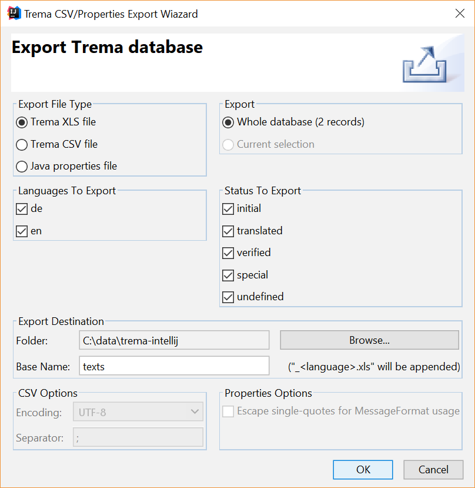
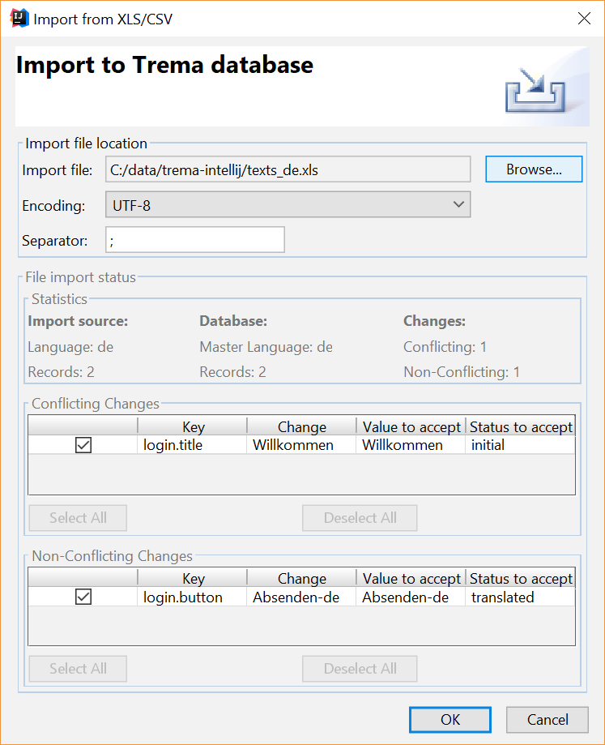

trema-intellij
==============
[](https://github.com/mnetceteragroup/trema-intellij/blob/master/LICENSE)

### Table of contents
* [Introduction](#introduction)
* [Trema File Format](#trema-file-format)
* [Installation](#installation)
* [Usage](#usage)
    * [Creating a new Trema database file](#creating-a-new-trema-database)
    * [Editing a Trema Database file](#editing-a-trema-database-file)
    * [Exporting Trema database](#exporting-trema-database)
    * [Importing Trema database](#importing-trema-database)

# Introduction

Typically, applications store text resources in Java property files. Sophisticated mechanisms are provided to support 
multiple languages with fallback mechanisms in case a resource is not available for a certain language or even a complete language is not available.

The management of these text resource files is tedious and error prone. Typically, developers fill in draft values 
for one language. The customer will later give feedback and request changes. Additionally, the customer or a translation 
office will deliver other language sets. These exchanges between developer and customer typically happen multiple times.

The Java property file format is not appropriate for this exchange for several reasons.

* Keys and values are not stored in a tabular way. Therefore, the file cannot be opened by non-techies with a standard tool such as MS Excel
* There is no possibility to add meta information to the single resources as where it is being used, what the current state of the translation is, etc.
* Merging of different versions of these property files can be very tedious, e.g. if the translator completely reordered
 the resources within the file
For these reasons Netcetera developed Trema, a tool to manage multilanguage application text resources.

Trema stores these resources in the Trema database, which is an xml file. The database contains text keys and values. 
Values for each key might be present in one or several languages. Additionally the database contains metadata about the text resources.

The Trema IntelliJ Plugin allows developers to edit the text resources in the database. Additionally, it allows to 
export and import the texts to/from xls files. These xls files are used to get translation work done: 
The translator adds translated values to the xls file (translating values as provided by the developer in the 'master language'). 
The xls file can then be imported back into the trema database by the developer.

In order to make the text resources available to the application, exporting the database into application specific 
resource files is done at build time using the Trema Maven Plugin. Currently the plugin allows to export the database 
into Java properties, CSV and XLS files.

Documentation about the Trema Maven Plugin is available on the 
[Trema Maven Plugin site](https://github.com/netceteragroup/trema-maven).

If you encounter any issues with Trema please don't hesitate to create a new issue in our 
[Trema IntelliJ Github Page](https://github.com/netceteragroup/trema-intellij).

# Trema File Format
Trema files are xml files that end with '.trm'. There is a schema file which can be found at this 
[link](https://raw.githubusercontent.com/netceteragroup/trema-core/master/src/main/resources/trema-1.0.xsd).

The following example shows the basic structure:

```xml
<?xml version="1.0" encoding="UTF-8"?>
<!-- generated on Tue Jan 13 18:15:42 CET 2009 -->
<trema xmlns:xsi="http://www.w3.org/2001/XMLSchema-instance" masterLang="de" 
  xsi:noNamespaceSchemaLocation="https://raw.githubusercontent.com/netceteragroup/trema-core/master/src/main/resources/trema-1.0.xsd">
  <text key="dialog.login.title">
    <context>Title of the log in dialog</context>
    <value lang="de" status="initial">Hallo, bitte einloggen</value>
    <value lang="en" status="initial">Hi, please log in</value>
  </text>
  <text key="logout.message">
    <context>Message displayed after log out button is pressed</context>
    <value lang="de" status="initial">Auf Wiedersehen!</value>
    <value lang="en" status="initial">Goodbye!</value>
  </text>
</trema>
```

Explanation:

* **masterLang**: Usually an application is first implemented in only one language, the master language. The text values 
are then used to derive the values for other languages. When the text resources are exported into an xls file for 
translation, the master language values are always included and serve as basis for the translation.
* **text key**: Each text is identified by a unique key. Values can be added for several languages (a value in the 
master language should always be present). the key is used as key in the java property files
* **context**: A description of the text resource. Offers the developer and also the translator additional information 
about the text, i.e. where and how it is used in the application.
* **lang**: Defines the language of a text value
* **status**: There are several states that can be associated with text values. They are used to track the state that 
a text resource is in (i.e. draft version vs. translated by a professional translator), to protect text resources from 
accidental overriding and to all partial export of text resources based on their state.

Supported states are:

* **initial**: draft state, texts are intended to be overwritten by imports
* **translated**: texts can still be overwritten, depending on the state in the xls, explicit accepting might be necessary
* **verified**: texts cannot be overwritten in succeeding imports from xls without explicitly accepting the change
* **special**: texts cannot be overwritten by imports from xls

A typical usecase is:

* newly added texts are in initial state
* all texts with state 'inital' are exported and given to a translator
* after re-importing the translated file the state of the values (automatically) changes to 'translated'
* after texts have been verified to be correct in the application (i.e. after the customer has signed of the app) the 
state can be set to verified, which protects the texts from being overwritten by succeeding imports.
* special is used for texts that are not intended for any translation (i.e import/export)

# Installation
You can install the Trema IntelliJ Plugin from the 
[IntelliJ Plugin Repository](https://plugins.jetbrains.com/plugin/11212-trema).

# Usage
### Creating a new Trema database
Follow the steps below to create a new, empty Trema database file

* Step 1: File > New > Trema XML Database
* Step 2: Enter details 
    * **Folder**: the src/main/resources folder in your project is a common place to put text resources in
    * **File name**: text.trm is a good default, since the trema-maven-plugin by default expects the trm database to be 
    at: `${project.basedir}/src/main/resources/text.trm`
    * **Encoding**: UTF-8 is advisable.
    * **Master language**: The main language. Developers adding new texts will add text values in the master language. 
    Translators can then translate from the master language to other languages
    * **Schema Location (optional)**: The xsd for validation of the trema file. The current version is here: 
    https://raw.githubusercontent.com/netceteragroup/trema-core/master/src/main/resources/trema-1.0.xsd
    


### Editing a Trema Database file
Editing a trema database file is done by using IntelliJ editor. Note that proper xml escaping in any of the texts needs 
to be done manually when this editor is used.



### Exporting Trema database
You can export the Trema file to CSV, Properties and XLS files using the Trema IntelliJ Plugin. This can be done by simply
selecting the Export option from the Trema context menu group. Right-click on a trema file, select the Trema > Export option 
and configure the export options. 

You can export to CSV, XLS or Java property file. There are some additional options to choose, like which languages to 
export, or to choose only keys with specific status. The result of the export will be a file for each selected language.



### Importing Trema database
The option for importing to Trema database file is found in the same context group as exporting. Since Trema need to know 
to which file to import, you need to select the trema destination file. Right-click the trema database file, select 
Trema > Import from CSV/XLS and an Import window will appear. Select the source file and some additional options like 
encoding, or separator for CSV file source and Trema will process the contents and generate a change summary before importing.
You can also choose which fields to import.

If there are conflicting fields, you can choose to accept the change from the import source, or skip the change. 

You can see how many records will be updated, and resolve conflicts, if any. If there are some fields that do not exist
in the Trema database file, the plugin will ignore them. 

